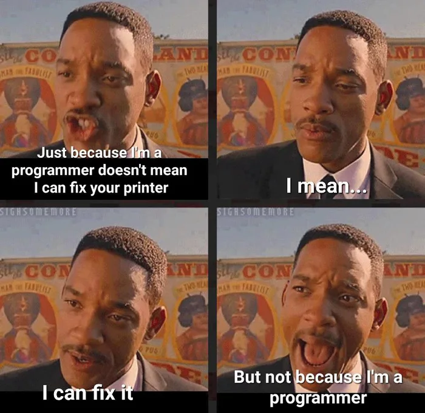
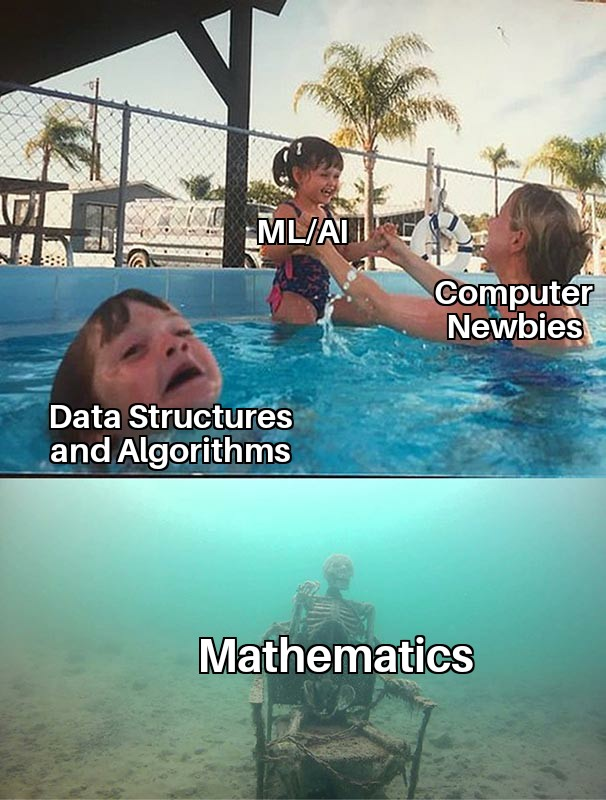
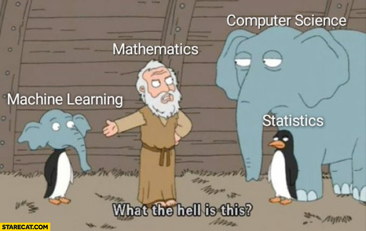

Métaphore filée

- Couteau VS informatique (ordinateur)
- Métiers

Algo de tri

Par un dev

```js
let a = [];
for (let i = 0; i < 100; ++i) {
  a.push(Math.floor(Math.random() * 1000));
}

a.sort((x, y) => x - y);
```

```python
from random import randrange
a = [randrange(1000) for _ in range(100)]
a.sort()
```

le smaths

$sort : \mathbb{N}^\star \to \mathbb{N}^\star$ telle que $a$ et $sort(a)$ on les mêmes éléments et $sort(a)$ est trié, $\forall i \in [1\ldots \mathrm{len}(a) - 1]$ il est vrai que $a[i] \leq a[i+1]$

Printers




ML/IA vs fondation





<https://www.lemonde.fr/blog/binaire/2014/02/05/la-place-de-linformatique-dans-la-classification-des-sciences/>

L’informatique parle d’objets de différente nature : informations, langages, machines et algorithmes. 


Chacun de ces quatre concepts est antérieur à l’informatique, mais ce qui ce que l’informatique apporte sans doute de nouveaux est leur organisation en une science cohérente. L