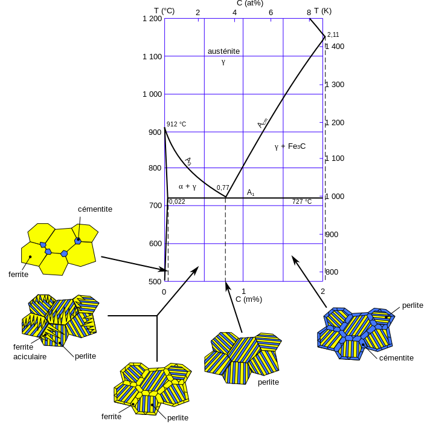
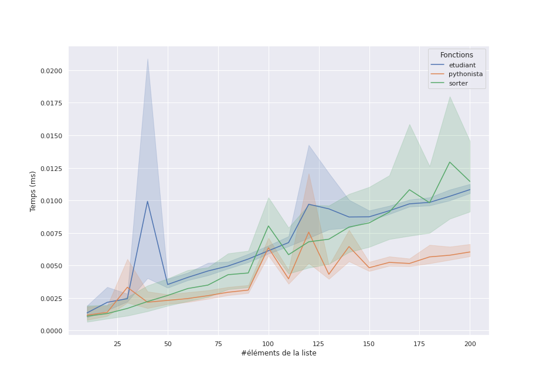
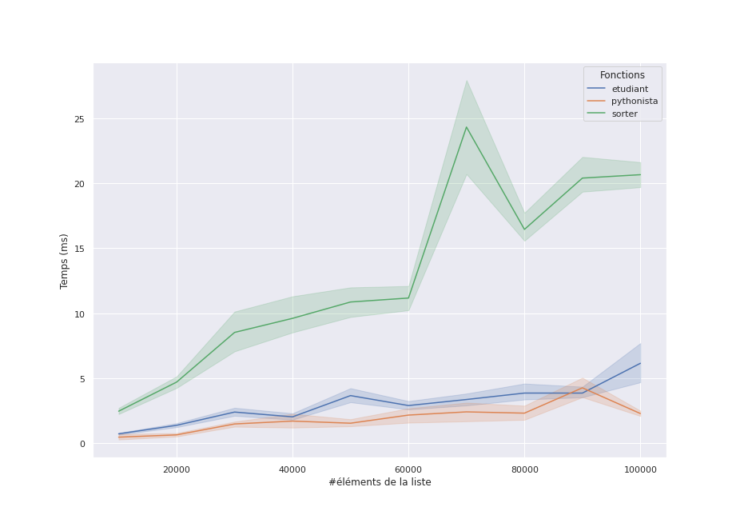

## Introduction au séminaire

::: notes
Exposé proposé pour l'action _"Les lycéens à la fac"_ du salon des études supérieures du 29 juillet 2022 de l'UNC (13h, Amphi A400).
:::

---

### Présentation personnelle

#### Formation

- 2004 : Ingénieur Informatique/DEA, INSA de Lyon
- 2008 : Doctorat Informatique, INSA de Lyon

#### Emplois

- 2008-2010 : postdoc INRIA Grenoble
- 2010-2022 : maître de conférences en informatique
  - 2010-2020 : Université Claude Bernard Lyon 1
  - 2020-2022 : Université de la Nouvelle-Calédonie

#### Thématiques

- bases de données, sécurité, science des données

---

#### Avant-propos

**Clause de non-responsabilité** : ni philosophe, ni sociologue, ni développeur : _enseignant-chercheur **en informatique**_.

::: notes

Beaucoup de métiers en informatique, j'en parle, mais on va centrer sur _la science_

:::

---

### Les informaticiens détestent-ils les imprimantes ?

](img/printer_programmer.png)

:::notes

blague : l'imprimante est un decalopode capricieux, qui comme le poulpe, une fois au pied du mur jette de l'encre sur ses aggresseurs et se vexe en bourrant le papier

:::

---

#### Pourquoi les informaticiens détestent-ils les imprimantes ?

- il faut se déplacer pour tester ?
- c'est [salissant](https://www.reddit.com/r/CatastrophicFailure/comments/8flfri/toner_explosion/) ?
- il y a des humains, généralement irrités de la situation ?
- les pilotes sont fermés ? (voir [The Story of Open Source](https://amogh.medium.com/the-story-of-open-source-so-far-bfcb685d85a4))

. . .

Ce n'est pas le métier **d'un développeur** (ni celui d'un _architecte logiciel_, d'un _intégrateur_, d'un _testeur_, d'un _administrateur réseaux_ etc).

. . .

Ce n'est pas non plus le métier **d'un enseignant-chercheur**.

::: notes

Les grosses **questions** :

- quels sont ces métiers ?
- qu'est ce qui les différencie ?

séparer l'utilisateur du concepteur va nous amener, retrospectivement à séparer le du développeur/concepteur du chercheur/scientifique
:::

---

Quels sont **ces métiers**, qu'est ce qui _les différencie_ ?

. . .

Une partie de la réponse est : _la science informatique_.

---

### Objectifs de la conférence

- rompre certaines **idées reçues** sur l'informatique et ses métiers
- positionner la **science informatique** dans le champ technique et scientifique
- **motiver les contenus** des formations universitaires en informatique

::: notes

Pour la formation, à l'UNC ou ailleurs, ce n'est pas très différent

:::

---

## L'informatique : science, technique ou art ?

](img/taoc.jpg)

---

### Métaphore du couteau

Un parallèle entre _utiliser_, _réaliser_ et _penser_ un couteau en acier et un programme informatique.

---

#### Utiliser un couteau - l'art

](img/using-knife-safely.jpeg)

---

#### Fabriquer un couteau - la technique

](img/forging-blade.jpg)

---

#### Fabriquer un acier - la science



::: notes

L'acier a été découvert très tôt dans l'histoire car sa matière première est abondante (minerai), et qu’il est facile à travailler. L'acier « de base » est de fait peu onéreux.

    fer : moins de 0,008 % de carbone en masse
    acier : entre 0,008 et 2,11 % de carbone ;
    fonte : teneur supérieure à 2,11 %.

Diagramme binaire fer-carbone et structure cristalline des aciers à l'état recuit
:::

---

#### Parallèle

|               | _Acier_                           | _Informatique_               |
| ------------- | --------------------------------- | ---------------------------- |
| **Art**       | cuisinier                         | utilisateur                  |
| **Technique** | artisan forgeron                  | développeur                  |
|               | ingénieur méttalurgiste           | ingénieur informaticien      |
| **Science**   | physico-chimiste, cristallographe | scientifique en informatique |

::: notes

- Une question de **recul** : les _utilisateurs_ d'un langage de programmation **sont** des _développeurs_.
- La _création n'est pas descendante mais faite de va-et-vient_ : les besoins des développeurs amènent à (re)penser les langages de programmations.
  - dans bcp de process sci, dont les maths
  - pas de sots métiers !
- Acier/dev : un parallèle assez naturel, car on parle de forge, de craftmanship dans le domaine du développement

:::

---

### Une définition de la science informatique (1/2)

<!-- #### Informatics -->

> **Informatics** is the scientific discipline that underpins the digital world.

[Informatics Reference Framework for School](https://www.informaticsforall.org/the-informatics-reference-framework-for-school-release-february-2022/).

NDA : _informatics_ synonyme de _computer science_.

---

### Une définition de la science informatique (2/2)

> L’informatique parle d’objets de différente nature : **informations**, **langages**, **machines** et **algorithmes**.

[La place de l'informatique dans la classification des sciences, Gilles DOWEK, 2014](https://www.lemonde.fr/blog/binaire/2014/02/05/la-place-de-linformatique-dans-la-classification-des-sciences/)

::: notes

Chacun de ces quatre concepts est _antérieur à l’informatique_, mais ce qui ce que l’informatique apporte sans doute de nouveaux est _leur organisation en une science cohérente_.

:::

---

## Le problème `min-max`

**Problème** trouver _le plus grand_ élément **et** _le plus petit_ élément d'une collection linéaire (par exemple : liste, tableau) _non-vide_ d'entiers naturels.

---

### Différentes solutions

#### Solution _étudiant_

```python
def min_max_etudiant(arr):
    the_min = arr[0]
    the_max = arr[0]
    for v in arr:
        if v < the_min:
            the_min = v
        if v > the_max:
            the_max = v

    return the_min, the_max

min_max_etudiant([1, 42, 3, 2, 0, 5]) #renvoie (0, 42)
```

. . .

_C'est une solution classique et correcte une séquence d'opérations élémentaires, au plus proche de l'algorithmique_.

::: notes

- arr est non-vide, on prend le premier
- classique et correcte **MAIS** un dev de doit jamais écrire ça !

:::

---

#### Solution _développeur_

```python
def min_max_sorter(arr):
    s = sorted(arr)
    # s[0] le premier élément après le tri
    # s[-1] le dernier élément après le tri
    return s[0], s[-1]
```

. . .

_C'est une solution correcte, où le développeur utilise une fonction de tri qu'il sait disponible dans à peu près tous les langages (ici Python)_.

::: notes
mais... il y a un mais !
:::

---

#### Solution _Pythonista_

```python
def min_max_pythonista(arr):
    return min(arr), max(arr)
```

. . .

_C'est une solution correcte aussi, où le développeur connait bien le langage Python et propose une solution "Pythonique"_.

::: notes

:::

---

### Quelle est la meilleure solution ?

#### Définir **meilleure**

. . .

- la plus _efficace en temps_ ?
- la plus _efficace en mémoire_ ?
- la plus _élégante_, la plus _lisible_ ?
- la plus rapide _à programmer_ ?

. . .

On va ici évaluer _l'efficacité **en temps**_

---

#### Critères d'efficacité en temps

. . .

Comment avoir une **évaluation robuste** des trois solutions ?

. . .

Comment faire des **prédictions** quant-à leurs comportements selon la taille des données ?

::: notes

Robuste : (indépendantes des contigences matérielles), voir du modèle de calcul

Ne pas sous-estimer/oublier que généralement on a pas besoin de performance !

Si on fait la somme du temps d'exec plus du temps de dev, Python est plus rapide que le C car on code beaucoup plus rapidement des tâches complexes

Pour l'évaluation empirique des performances **sur quelle machine, quel OS, quelle version de Python, quel jeu de données ?**

:::

---

#### Évaluation empirique (1/2)



**Peut-on déterminer quelle est la meilleure solution ?**

::: notes

Pas vraiment

On voit au passage que l'ordre n'est pas le même et qu'il y a de la variance.

Une autre exec ne donnera pas le même résultat

:::

---

#### Évaluation empirique (2/2)



**Peut-on déterminer quelle est la meilleure solution ?**

---

### La compléxité algorithmique

- peut-on **modéliser** les comportements de ces algorithmes ?
  - **Oui** avec l'évaluation (asymptotique) de la complexité (au pire cas) en fonction de la taille de l'entrée
- peut-on **comparer** leurs comportements ?
  - **Oui, en partie** en comparant leur complexité
- peut-on **prédire** le temps d'exécution ?
  - **Non**, car on est dépendants de facteurs inconnus **et** des entrées

::: notes
comportements = allure des courbes

:::

---

- Que **compter** ?
  - le nombre comparaisons entre entiers
- Combien de **comparaisons** sont effectuées ?
  - pour `min_max_etudiant` : _oui_
  - pour `min_max_sorted` : il faut `min` et `max`
    - mais on les imagine facilement
  - pour `min_max_pythonista` : il faut `sorted`
    - et là, c'est un peu plus compliqué...
    - ...voir [le code source de `CPython`](https://github.com/python/cpython/blob/main/Objects/listsort.txt)
    - mais on connaît les algorithmes

---

### Modélisation de `min_max_etudiant`

```python
def min_max_etudiant(arr):
    # soit n la longueur de la séquence, n = len(arr)
    the_min = arr[0]
    the_max = arr[0]
    for v in arr: # on passe (n-1) fois dans cette boucle
        # une comparaison ici
        if v < the_min:
            the_min = v
        # une autre comparaison là
        if v > the_max:
            the_max = v
    return the_min, the_max
```

Pour une entrée de longueur $n$, on effectue $2 \times (n-1)$ comparaison

. . .

Ce qui compte, c'est **l'ordre de grandeur**, ici, proportionnel à $n$

---

### Comparaison des compléxités

En utilisant la notation de Landau, dite _grand O_ :

Soient $f,g : \mathbb{N} \to \mathbb{R}^+$ deux applications, on dit que _f est dominée par g_ (en $+\infty$) que l'on note $f(n) = O (g(x))$ lorsqu'il existe un rang $N \in \mathbb{N}$ et une constante $C \in \mathbb{R}^+$ tels que $\forall n > N, f(n) \leq C g(x)$.

---

| notation      | compléxité    | exemple                         |
| ------------- | ------------- | ------------------------------- |
| $O(1)$        | constante     | accès à un élément              |
| $O(log(n))$   | logarithmique | recherche dichotomique          |
| $O(n)$        | linéaire      | recherche 👈                    |
| $O(n.log(n))$ |               | "bon" tri                       |
| $O(n^2)$      | quadratique   | "mauvais" tri                   |
| $O(n^c)$      | polynomiale   | produit de matrice naïf ($c=3$) |
| $O(c^n)$      | exponentielle | voyageur de commerce            |

---

### Comparaison des compléxités des solutions `min-max`

- `min_max_etudiant` est en $O(n)$
- `min_max_pythonista` est en $O(n)$ également
- `min_max_sorted` est en $O(n.log(n))$
  - c'est **moins bon** : on résoud un problème trop compliqué par rapport au besoin !

. . .

Ceci explique/confirme les allures des courbes !

::: notes

- Tout est à un coefficient près
- Rien n'est dit sur les constantes, clairement celle de pythonista est meilleure que celle de étudiant
- Optimiser, c'est changer la constante mais **surtout** changer les ordres de grandeurs
- Une notion de frugalité ?

:::

---

## La formation en informatique

Science **et** technique **et** art

. . .

- _science_ : ce qui est **vrai**
- _technique_ : ce qui est **faisable**
- _art_ : ce qui est **beau**

---

](img/ML_IA_VS_MATHS.jpg)

---

### Programmes

Sciences et techniques (et art) se déclinent :

- _langages_
  - paradigmes de programmation, développement, compilation
- _algorithmes_
  - structures de données, théorie de la compléxité, décidabilité, modèles de calculs
- _informations_ et _machines_
  - codage/représentation, réseau, système, informatique embarquée

---

#### Exemple

<https://unc.nc/formations/licence-informatique/>

---

## Références

- [Épistémologie de l'informatique, WIKIPEDIA](https://fr.wikipedia.org/wiki/%C3%89pist%C3%A9mologie_de_l%27informatique)
- [Pourquoi et comment le monde devient numérique, Gérard BERRY, leçon inaugurale au collège de France, 2008](https://www.college-de-france.fr/site/gerard-berry/inaugural-lecture-2008-01-17-18h00.htm)
- <https://www.reddit.com/r/ProgrammerHumor/>

[Notebook Python](code/minmax.ipynb)
