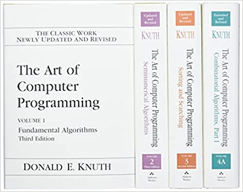

- [Introduction](#introduction)
  - [Présentation personnelle](#présentation-personnelle)
    - [Formation](#formation)
    - [Emplois](#emplois)
    - [Avant-propos](#avant-propos)
  - [Les informaticiens détestent les imprimantes](#les-informaticiens-détestent-les-imprimantes)
    - [Pourquoi les informaticiens détestent-ils les imprimantes ?](#pourquoi-les-informaticiens-détestent-ils-les-imprimantes-)
  - [Objectifs de la conférence](#objectifs-de-la-conférence)
- [Science, technique ou art ?](#science-technique-ou-art-)
  - [Métaphore du couteau](#métaphore-du-couteau)
    - [Utiliser (correctement) un couteau](#utiliser-correctement-un-couteau)
    - [Fabriquer un couteau](#fabriquer-un-couteau)
- [La formation en informatique dans le supérieur](#la-formation-en-informatique-dans-le-supérieur)
  - [La licence Informatique à l'UNC](#la-licence-informatique-à-lunc)
- [Références](#références)
  - [Images](#images)

---

## Introduction

---

### Présentation personnelle

#### Formation

- 2004 : Ingénieur Informatique/DEA, INSA de Lyon
- 2008 : Doctorat Informatique, INSA de Lyon

#### Emplois

- 2008-2010 : postdoc INRIA Grenoble
- 2010-2022 : maître de conférences en informatique
  - 2010-2020 : Université Claude Bernard Lyon 1
  - 2020-2022 : Université de la Nouvelle-Calédonie

---

#### Avant-propos

**Disclaimer** : ni philosophe, ni sociologue, ni développeur : _enseignant-chercheur en informatique_

---

### Les informaticiens détestent les imprimantes

Source [r/ProgrammerHumor](https://www.reddit.com/r/MemeTemplatesOfficial/comments/sk7nmt/will_smith_shouting_calm_shouting/)

---

#### Pourquoi les informaticiens détestent-ils les imprimantes ?

- il faut se déplacer pour tester
- c'est [salissant](https://www.reddit.com/r/CatastrophicFailure/comments/8flfri/toner_explosion/)
- il y a des humains, généralement irrités
- les logiciels sont propriétaires
  - [The Story of Open Source -- It all started with a laser printer -- The Xerox 9700](https://amogh.medium.com/the-story-of-open-source-so-far-bfcb685d85a4)
<!-- - les équipements sont conçus selon _l'obsolescence programmée_ -->

Et surtout, **ce n'est pas le métier d'un développeur (ou d'un enseignant-chercheur)**

### Objectifs de la conférence

- discuter les idées reçues sur l'informatique
- positionner la science informatique dans le champ technique et scientifique (et artistique)
- motiver les contenus des formations universitaires en informatique (UNC ou ailleurs)

---

## Science, technique ou art ?

Source [Amazon](https://images-na.ssl-images-amazon.com/images/I/410vJZbAZGS._SY393_BO1,204,203,200_.jpg)

> Informatics is the scientific discipline that underpins the digital world.

Source [Informatics Reference Framework for School](refs/Informatics-Reference-Framework-for-School-release-February-2022.pdf)

> Informatics is a distinct scientific discipline, characterised by its own concepts, methods, body of knowledge, and open issues. It can be synthetically described as the science of automated processing of representations. It covers the foundations of computational structures, processes, artefacts and systems, as well as their software designs, their applications, and their impact on society.

### Métaphore du couteau

#### Utiliser (correctement) un couteau

Source [medium.com -- How To Use Kitchen Knives -- Safety Tips](https://medium.com/@alyarb03/how-to-use-kitchen-knives-safety-tips-5f073a98a18b)

---

#### Fabriquer un couteau

Source [Industrial Heating -- Forging Knives in College](https://www.industrialheating.com/articles/95969-forging-knives-in-college)

---

## La formation en informatique dans le supérieur

Science **et** technique **et** art

### La licence Informatique à l'UNC

## Références

- [Épistémologie de l'informatique, WIKIPEDIA](https://fr.wikipedia.org/wiki/%C3%89pist%C3%A9mologie_de_l%27informatique)
- [Pourquoi et comment le monde devient numérique, Gérard BERRY, leçon inaugurale au collège de France, 2008](https://www.college-de-france.fr/site/gerard-berry/inaugural-lecture-2008-01-17-18h00.htm)

### Images

- <https://www.reddit.com/r/ProgrammerHumor/comments/hl08s3/from_hello_world_to_directly_machine_learning/>
- <https://starecat.com/machine-learning-noah-what-the-hell-is-this-child-of-computer-science-statistics-and-mathematics/>

<https://www.reddit.com/r/ProgrammerHumor/>

https://www.lemonde.fr/blog/binaire/2014/02/05/la-place-de-linformatique-dans-la-classification-des-sciences/

> Through the digital representation of real-world objects, it helps the understanding of processes of modelling and manipulating them. The informatics approach to thinking about problems and their solutions is of key importance for understanding our contemporary and future digital society, its advantages, limitations, and dangers. By supporting cognitive processes of human beings and mediating their communications, it can affect human life and social relations in fundamental ways. Therefore, in providing a short description of the discipline, it is important to list both inward-looking (i.e., focusing on the discipline) and outward-looking (i.e., focusing on the impact of the discipline) aspects of informatics.
