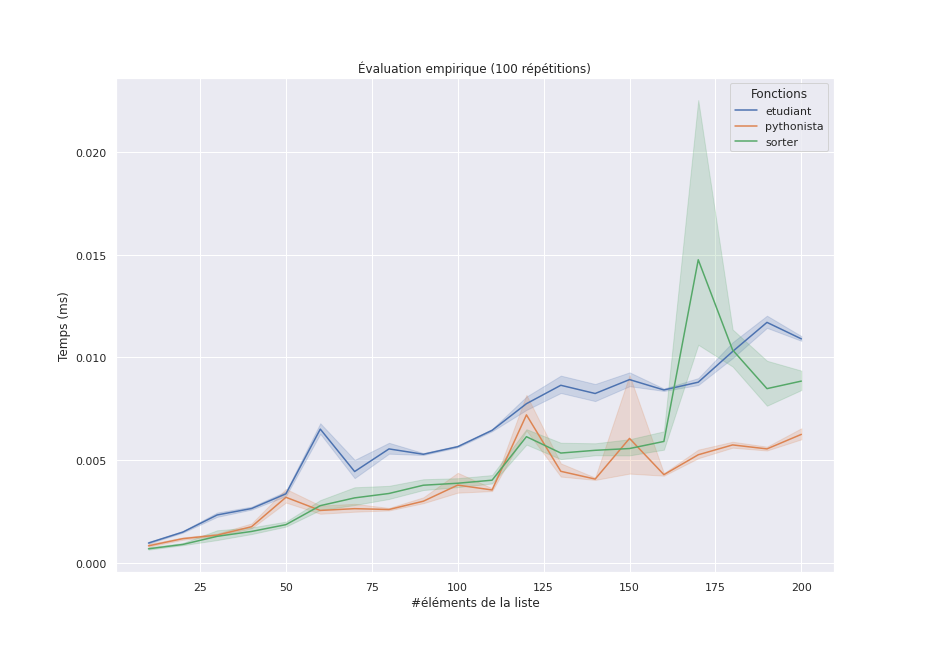
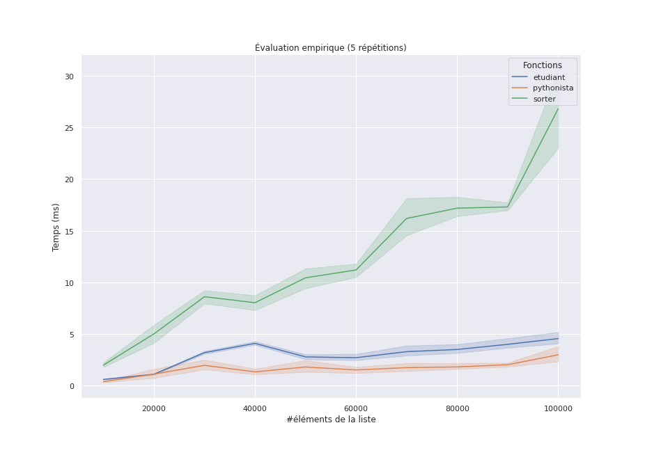

## Introduction au séminaire

::: notes
Exposé proposé pour l'action _"Les lycéens à la fac"_ du salon des études supérieures du 29 juillet 2022 de l'UNC (13h, Amphi A400).
:::

---

- [Introduction au séminaire](#introduction-au-séminaire)
- [L'informatique : science, technique ou art ?](#linformatique--science-technique-ou-art-)
- [Le problème `min-max`](#le-problème-min-max)
- [La formation en informatique](#la-formation-en-informatique)
- [Références](#références)

---

### Présentation personnelle

#### Formation

- 2004 : Ingénieur Informatique/DEA, INSA de Lyon
- 2008 : Doctorat Informatique, INSA de Lyon

#### Emplois

- 2008-2010 : postdoc INRIA Grenoble
- 2010-2022 : maître de conférences en informatique
  - 2010-2020 : Université Claude Bernard Lyon 1
  - 2020-2022 : Université de la Nouvelle-Calédonie

---

#### Avant-propos

**Clause de non-responsabilité** : ni philosophe, ni sociologue, ni développeur : _enseignant-chercheur **en informatique**_.

::: notes

Beaucoup de métiers en informatique, j'en parle, mais on va centrer sur _la science_

:::

---

### Les informaticiens détestent-ils les imprimantes ?

](img/printer_programmer.png)

:::notes

blague : l'imprimante est un decalopode capricieux, qui comme le poulpe, une fois au pied du mur jette de l'encre sur ses aggresseurs et se vexe en bourrant le papier

:::

---

#### Pourquoi les informaticiens détestent-ils les imprimantes ?

- il faut se déplacer pour tester
- c'est [salissant](https://www.reddit.com/r/CatastrophicFailure/comments/8flfri/toner_explosion/)
- il y a des humains, généralement irrités
- les logiciels sont propriétaires (voir [The Story of Open Source](https://amogh.medium.com/the-story-of-open-source-so-far-bfcb685d85a4))

. . .

Ce n'est pas le métier **d'un développeur** (ni celui d'un architecte logiciel, d'un intégrateur, d'un testeur etc).

. . .

Ce n'est pas non plus le métier **d'un enseignant-chercheur**.

::: notes

Les grosses **questions** :

- quels sont ces métiers ?
- qu'est ce qui les différencie ?

séparer l'utilisateur du concepteur va nous amener, retrospectivement à séparer le du développeur/concepteur du chercheur/scientifique
:::

---

Quels sont **ces métiers**, qu'est ce qui _les différencie_ ?

. . .

Une partie de la réponse est : _la science informatique_.

---

### Objectifs de la conférence

- rompre certaines **idées reçues** sur l'informatique et ses métiers
- positionner la **science informatique** dans le champ technique et scientifique
- **motiver les contenus** des formations universitaires en informatique

::: notes

Pour la formation, à l'UNC ou ailleurs, ce n'est pas très différent

:::

---

## L'informatique : science, technique ou art ?

](img/taoc.jpg)

---

### Métaphore du couteau

Un parallèle entre _utiliser_, _réaliser_ et _penser_ un couteau en acier et un programme informatique.

---

#### Utiliser un couteau - l'art

](img/using-knife-safely.jpeg)

---

#### Fabriquer un couteau - la technique

](img/forging-blade.jpg)

---

#### Fabriquer un acier - la science


::: notes

L'acier a été découvert très tôt dans l'histoire car sa matière première est abondante (minerai), et qu’il est facile à travailler. L'acier « de base » est de fait peu onéreux.

    fer : moins de 0,008 % de carbone en masse
    acier : entre 0,008 et 2,11 % de carbone ;
    fonte : teneur supérieure à 2,11 %.

Diagramme binaire fer-carbone et structure cristalline des aciers à l'état recuit
:::

---

#### Parallèle

|               | _Acier_                           | _Informatique_               |
| ------------- | --------------------------------- | ---------------------------- |
| **Art**       | cuisinier                         | utilisateur                  |
| **Technique** | artisan forgeron                  | développeur                  |
|               | ingénieur méttalurgiste           | ingénieur informaticien      |
| **Science**   | physico-chimiste, cristallographe | scientifique en informatique |

::: notes

un parallèle assez naturel, car on parle de forge, de craftmanship dans le domaine du développement

:::

---

### Une définition de la science informatique

#### Informatics

> Informatics is the scientific discipline that underpins the digital world.

Source [Informatics Reference Framework for School](https://www.informaticsforall.org/the-informatics-reference-framework-for-school-release-february-2022/)

---

### Une définition en français

[La place de l'informatique dans la classification des sciences, Gilles DOWEK, 2014](https://www.lemonde.fr/blog/binaire/2014/02/05/la-place-de-linformatique-dans-la-classification-des-sciences/)

> L’informatique parle d’objets de différente nature : **informations**, **langages**, **machines** et **algorithmes**.

::: notes

Chacun de ces quatre concepts est _antérieur à l’informatique_, mais ce qui ce que l’informatique apporte sans doute de nouveaux est _leur organisation en une science cohérente_.

:::

---

## Le problème `min-max`

**Problème** trouver le plus grand élément **et** le plus petit élément d'une collection linéaire (e.g., liste, tableau) _non-vide_.

---

### Différentes solutions

#### Solution _de l'étudiant·e_

```python
def min_max_etudiant(arr):
    the_min = arr[0]
    the_max = arr[0]
    for v in arr:
        if v < the_min:
            the_min = v
        if v > the_max:
            the_max = v

    return the_min, the_max
```

. . .

_C'est une solution algorithmique classique : une séquence d'opérations élémentaires qui produit un résultat correct_.

---

#### Solution _de développeur_

```python
def min_max_sorter(arr):
    s = sorted(arr)
    return s[0], s[-1]

```

. . .

_C'est une solution correcte, où le développeur utilise une fonction de tri qu'il sait disponible dans à peu près tous les langages (ici Python)_.

---

#### Solution _de Pythonista_

```python
def min_max_pythonista(arr):
    return min(arr), max(arr)
```

. . .

_C'est une solution correcte aussi, où le développeur connait bien le langage Python et propose une solution "Pythonique"_.

---

### Quelle est la meilleure solution ?

- la plus rapide en pratique _à exécuter_ ?
- la plus frugale en pratique _en mémoire_ ?
- la plus _élégante, lisible_ ?
- la plus rapide _théoriquement_ ?
- la plus rapide **à écrire** ?

. . .

Comment avoir une évaluation robuste des trois solutions, des prédictions quant-à leurs comportements ?

::: notes

Ne pas sous-estimer/oublier que généralement on a pas besoin de performance !

Si on fait la somme du temps d'exec plus du temps de dev, Python est plus rapide que le C car on code beaucoup plus rapidement des tâches complexes

Pour l'évaluation empirique des performances **sur quelle machine, quel OS, quelle version de Python, quel jeu de données ?**

:::

---



---



---

### Comment prédire ces comportements

L'évaluation asymptotique de la complexité (au pire cas)

## La formation en informatique

Science **et** technique **et** art

---

](img/ML_IA_VS_MATHS.jpg)

---

### La licence Informatique à l'UNC

---

## Références

- [Épistémologie de l'informatique, WIKIPEDIA](https://fr.wikipedia.org/wiki/%C3%89pist%C3%A9mologie_de_l%27informatique)
- [Pourquoi et comment le monde devient numérique, Gérard BERRY, leçon inaugurale au collège de France, 2008](https://www.college-de-france.fr/site/gerard-berry/inaugural-lecture-2008-01-17-18h00.htm)
- <https://www.reddit.com/r/ProgrammerHumor/>
